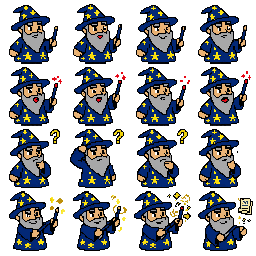

<div align="center">
  

  # 🤖 Bit - Desktop Pet con IA

  *Tu asistente mágico en el escritorio*  
  *Estilo Windows 98/XP con cerebro de IA híbrida*

  <p align="center">
    
    
    
    
    
  </p>
</div>

---

## ✨ Características

- 🧙‍♂️ **Personaje animado** con sprite sheet pixel art (Merlin el mago)
- 👩 **Eve** personaje anime con animación idle
- 💬 **Globo de diálogo** retro con efecto typewriter
- 🤖 **IA híbrida**: Ollama local + OpenAI/Claude en la nube
- 🖱️ **Arrastrable** por el escritorio (drag & drop)
- 🪟 **Ventana transparente**, sin bordes, siempre encima
- ⚙️ **Panel de configuración** con click derecho
- 🔒 **API keys** seguras (configuración persistente)

## 🚀 Instalación

### Requisitos
- Node.js 18+
- Rust (latest stable)
- [Ollama](https://ollama.ai) (opcional, para IA local)

### Linux (Ubuntu/Debian)
```bash
# Dependencias de Tauri
sudo apt install libwebkit2gtk-4.1-dev libgtk-3-dev \
                 libayatana-appindicator3-dev librsvg2-dev patchelf

# Clonar e instalar
git clone https://github.com/tuusuario/mascota-ia
cd mascota-ia
npm install
npm run tauri dev
```

### Windows
```bash
# Requiere Visual Studio Build Tools
git clone https://github.com/tuusuario/mascota-ia
cd mascota-ia
npm install
npm run tauri dev
```

### Para producción
```bash
npm run tauri build
# Binarios en: src-tauri/target/release/bundle/
```

## 🎮 Cómo usar

| Acción | Resultado |
|--------|-----------|
| 🖱️ **Click** sobre el personaje | Abre/cierra el chat |
| 🖱️ **Click derecho** | Panel de configuración |
| ✏️ **Escribir** y Enter | Envía mensaje a la IA |
| 🖱️ **Arrastrar** | Mueve la ventana |
| `/bye` | Cierra la aplicación |

## 🧠 Configurar IA

### Opción A: Ollama (local, recomendado)
```bash
ollama pull llama3.2
ollama serve
```
Bit detecta Ollama automáticamente en `http://localhost:11434`

### Opción B: API Cloud
1. Click derecho → Configuración
2. Seleccionar OpenAI o Claude
3. Ingresar API Key
4. Guardar

## 🏗️ Stack Tecnológico

| Capa | Tecnología |
|------|-----------|
| Frontend | React 19 + TypeScript + Vite |
| Backend | Rust + Tauri v2 |
| Sprites | Pixel art (CSS background-position / img) |
| IA Local | Ollama API (llama3.2, mistral, etc.) |
| IA Cloud | OpenAI / Claude API |
| Empaquetado | Tauri Bundler (deb, AppImage, msi) |

## 📁 Estructura del Proyecto

```
mascota-ia/
├── src/
│   ├── assets/          # Sprites y recursos
│   │   └── sprite-wizard.png
│   ├── components/
│   │   ├── Character.tsx        # Personaje animado
│   │   ├── CharacterSelector.tsx # Selector de personaje
│   │   ├── ConfigPanel.tsx      # Panel de configuración
│   │   └── eve/                 # Sprites de Eve
│   ├── services/
│   │   └── ai.ts               # Servicio IA híbrida
│   ├── App.tsx                  # Componente principal
│   ├── main.tsx                 # Entry point
│   └── index.css                # Estilos globales
├── src-tauri/
│   ├── src/
│   │   └── main.rs             # Comandos Rust
│   └── Cargo.toml               # Dependencias Rust
└── package.json
```

## 🗺️ Roadmap

- [x] Fase 1: MVP con personaje animado + chat + IA
- [ ] Fase 2: Almacenamiento seguro de API keys
- [ ] Fase 3: Instaladores para Linux y Windows
- [ ] Fase 4: Auto-updater
- [ ] Fase 5: Más personajes y animaciones
- [ ] Fase 6: Notificaciones del sistema
- [ ] Fase 7: Modo oscuro y temas

## 🤝 Contribuir

1. Fork el proyecto
2. Crear rama: `git checkout -b feature/nueva-funcionalidad`
3. Commit: `git commit -m 'Agrego nueva funcionalidad'`
4. Push: `git push origin feature/nueva-funcionalidad`
5. Abrir Pull Request

## 📝 Licencia

MIT License - ver [LICENSE](LICENSE)

---

<div align="center">
  <sub>Hecho con ❤️ para convertir tu escritorio en un lugar más mágico</sub>
  <br>
  <sub>Inspirado en Clippy, Rover y los asistentes de los 90s</sub>
</div>
